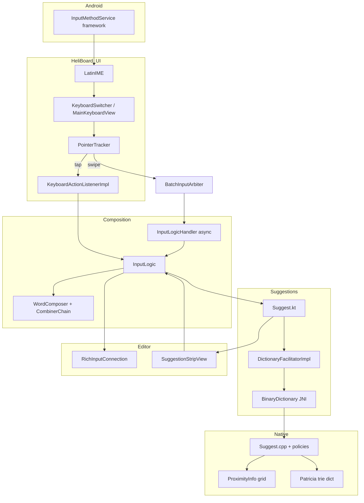

# Architecture overview

HeliBoard implements Android’s `InputMethodService` as **LatinIME** — the central coordinator between touch UI, word composition, native dictionary decoding, and the host app’s text field (`InputConnection`).

## Service entry

- **Class:** `helium314.keyboard.latin.LatinIME` extends `InputMethodService`
- **Manifest:** `AndroidManifest.xml` declares IME service + spell checker service
- **Init:** Settings, `DictionaryFacilitator` (via provider), `InputLogic`, `KeyboardSwitcher`, native lib via `JniUtils.loadNativeLibrary()`

## End-to-end flow

## Tap typing path

1. **Touch:** `PointerTracker` resolves key hit; distinguishes tap vs gesture (`sInGesture`).
2. **Action:** `KeyboardActionListenerImpl` → `LatinIME.onEvent()` / code input callbacks.
3. **Logic:** `InputLogic.onCodeInput()` updates `WordComposer`, combiners, space/punctuation handling.
4. **Suggest:** `InputLogicHandler` (background) or synchronous paths call `Suggest.getSuggestedWords()`.
5. **Branch:** `wordComposer.isBatchMode == false` → `getSuggestedWordsForNonBatchInput()` (`Suggest.kt:70+`).
6. **Dict:** `DictionaryFacilitatorImpl.getSuggestionResults()` → each loaded `Dictionary` → `BinaryDictionary.getSuggestions()` JNI.
7. **UI:** `SuggestedWords` → `SuggestionStripView`; composing text + underline via `RichInputConnection` / `SuggestionSpanUtils`.
8. **Commit:** Space, punctuation, or picking suggestion → `commitText`; may update `UserHistoryDictionary`.

## Swipe typing path

1. **Touch:** `PointerTracker` enters gesture mode; samples points per `GestureStrokeRecognitionParams`.
2. **Batch:** `BatchInputArbiter` aggregates `InputPointers` across the stroke.
3. **IME:** `LatinIME.onStartBatchInput` / `onUpdateBatchInput` / `onEndBatchInput`.
4. **Async:** `InputLogicHandler` sets batch pointers on `WordComposer`, sets batch mode flag.
5. **Suggest:** `getSuggestedWordsForBatchInput()` (`Suggest.kt:266+`) with `ComposedData.mIsBatchMode = true`.
6. **Native:** Same facilitator + JNI, but decoder uses touch coordinates and **proximity** spatial model (see [04_swipe_gesture_input.md](04_swipe_gesture_input.md)).

## Key state objects

| Object | Responsibility |
|--------|----------------|
| `WordComposer` | Typed characters, batch pointers, caps, composing vs committed |
| `NgramContext` | Previous words for next-word prediction |
| `ComposedData` | Snapshot passed to native (code points + coordinates + batch flag) |
| `SettingsValuesForSuggestion` | Per-session flags (correction on, locale, etc.) |
| `SuggestedWords` | Ranked list, auto-correction target, prediction flag |

## Settings vs runtime

- **Settings:** `helium314.keyboard.settings` (Compose UI) → `Settings.java` / prefs → `SettingsValues` used when keyboard shown or field changes.
- **Reload:** `LatinIME.loadSettings()` clears suggestion caches, reloads dictionaries, keyboard layout.

## Spell checker

Separate code path: `AndroidSpellCheckerService` uses its own `DictionaryFacilitatorImpl` instance — related to main dict but not identical to IME suggestion strip.

## HeliBoard-specific extensions

Beyond stock LatinIME:

- Custom layouts via Floris-style JSON parser (`keyboard/internal/keyboard_parser/`)
- Optional **user-provided** or **Google** `libjni_latinime` for gesture (`JniUtils.java`)
- Gesture data gathering settings (`GestureDataGatheringSettings.kt`, NLNet-related facilitator swap in `LatinIME`)
- Extended language/layout settings, emoji tooling

## Refactor touchpoints (future)

| Layer | Primary files |
|-------|----------------|
| Policy | `Suggest.kt`, `AutoCorrectionUtils.java` |
| State machine | `InputLogic.java`, `InputLogicHandler.java` |
| Touch | `PointerTracker.java`, `BatchInputArbiter.java` |
| Geometry | `ProximityInfo.java`, `proximity_info.cpp` |
| Decode | `suggest.cpp`, typing/gesture policy impls |

See [07_key_files_index.md](07_key_files_index.md) for full path list.
