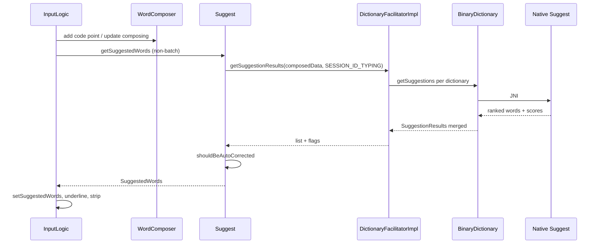

# Autocorrect and suggestions

Suggestions are produced by a **two-layer** system: native code scores dictionary candidates (spatial + language model); Kotlin/Java (`Suggest.kt`, `InputLogic.java`) decides what to show, underline, and auto-commit.

## Primary classes

| Layer | File | Role |
|-------|------|------|
| Policy | `app/src/main/java/helium314/keyboard/latin/Suggest.kt` | Fetch suggestions; `shouldBeAutoCorrected()`; tap vs batch branch |
| Threshold | `app/src/main/java/helium314/keyboard/latin/utils/AutoCorrectionUtils.java` | Normalized score vs threshold (JNI helpers) |
| Orchestration | `app/src/main/java/helium314/keyboard/latin/inputlogic/InputLogic.java` | Composing state, when to commit correction |
| Async | `app/src/main/java/helium314/keyboard/latin/inputlogic/InputLogicHandler.java` | Background suggestion fetch |
| UI | `app/src/main/java/helium314/keyboard/latin/suggestions/SuggestionStripView.kt` | Strip + user pick |
| Facilitator | `app/src/main/java/helium314/keyboard/latin/DictionaryFacilitatorImpl.kt` | Query all dicts, merge `SuggestionResults` |
| JNI dict | `app/src/main/java/com/android/inputmethod/latin/BinaryDictionary.java` | `getSuggestions()` native call |
| Native loop | `app/src/main/jni/src/suggest/core/suggest.cpp` | Core decode traversal |
| Typing score | `app/src/main/jni/src/suggest/policyimpl/typing/typing_scoring.cpp` | Tap spatial + language scoring |
| Threshold native | `app/src/main/jni/src/utils/autocorrection_threshold_utils.cpp` | Confidence for auto-correct |

## Tap suggestion flow



Entry branch in `Suggest.kt`:

```57:66:app/src/main/java/helium314/keyboard/latin/Suggest.kt
    fun getSuggestedWords(wordComposer: WordComposer, ngramContext: NgramContext, keyboard: Keyboard,
                          settingsValuesForSuggestion: SettingsValuesForSuggestion, isCorrectionEnabled: Boolean,
                          inputStyle: Int, sequenceNumber: Int): SuggestedWords =
        if (wordComposer.isBatchMode) {
            getSuggestedWordsForBatchInput(...)
        } else {
            getSuggestedWordsForNonBatchInput(...)
        }
```

## Autocorrect gates (`shouldBeAutoCorrected`)

Public for unit tests: `Suggest.kt:156-262`.

**Allows auto-correct** when (simplified):

- Whitelisted suggestion, or `SHOULD_AUTO_CORRECT_USING_NON_WHITE_LISTED_SUGGESTION`, or
- Word length > 1, not in dictionary, with `@`/`.` preserved on suggestions, or
- Score-based fallback using empty-word n-gram comparisons (`scoreLimit`, delta > 20)

**Actually auto-corrects** (`hasAutoCorrection`) only if ALL hold:

- User setting: correction enabled
- `allowsToBeAutoCorrected`
- Still composing a word (not pure prediction)
- Non-empty suggestion results
- No digits in word
- Not “mostly caps” (unless all caps)
- Not resumed suggestions session
- **Main dictionary must be initialized** (`hasAtLeastOneInitializedMainDictionary`) — avoids correcting to contact names with no lang dict
- `AutoCorrectionUtils.suggestionExceedsThreshold()` vs `mAutoCorrectionThreshold`
- `isAllowedByAutoCorrectionWithSpaceFilter()` — language-specific word shape
- Typed-word vs first-suggestion score tie-breakers (whitelist bonus, empty n-gram scores)

Notable comments in code:

- `mFirstSuggestionExceedsConfidenceThreshold` branch marked **currently useless** (always false) — `Suggest.kt:220-222`
- TODO on personalization vs no-main-dict rule — `Suggest.kt:214`
- Aggressive autocorrect when typed word unknown in n-gram context — `Suggest.kt:192`

## Settings affecting autocorrect

- `Settings.getValues().mScoreLimitForAutocorrect` — used inside `shouldBeAutoCorrected`
- `isCorrectionEnabled` passed from input logic / field attributes (password fields, etc.)
- Decoder flags in `DecoderSpecificConstants` (whitelist behavior, rejected suggestion removal)

## Commit and UI feedback

- `InputLogic.setSuggestedWords()` sets auto-correction target on `WordComposer`
- Blue underline: `SuggestionSpanUtils.kt` on composing text in `RichInputConnection`
- Space: may commit auto-correction word before inserting space
- User picking alternate suggestion bypasses auto-commit

## Tests

- `app/src/test/java/helium314/keyboard/latin/SuggestTest.kt` — extensive `shouldBeAutoCorrected` cases via test doubles

## Refactor notes (for future agents)

| Concern | Where to change |
|---------|-----------------|
| When to replace typed word | `Suggest.shouldBeAutoCorrected`, `InputLogic` commit paths |
| Score normalization | `AutoCorrectionUtils`, native `autocorrection_threshold_utils.cpp` |
| Candidate ranking | `DictionaryFacilitatorImpl`, native `typing_scoring.cpp`, `suggestions_output_utils.cpp` |
| “Type what I typed” | Likely **disable or narrow** auto-commit gates; possibly separate “strict tap” mode |
| Main-dict requirement | `Suggest.kt:208-215` — product decision for offline/contact-only typing |

Related: [05_dictionaries_and_learning.md](05_dictionaries_and_learning.md), [04_swipe_gesture_input.md](04_swipe_gesture_input.md)
