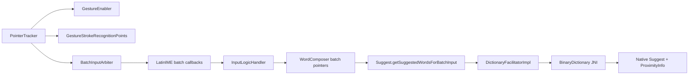

# Swipe / gesture input

Gesture typing is a **parallel pipeline** to tap typing: same `Suggest` / `DictionaryFacilitator` / JNI stack, but `WordComposer` runs in **batch mode** with a sequence of `(x, y, time)` pointers instead of explicit key code points.

## User-reported problem (context)

Users see words containing letters from **rows the stroke never crossed**. This is largely explained by the **ProximityInfo** spatial model: native decoding treats all keys *near* the stroke as plausible, not only keys directly under the finger. That is AOSP LatinIME design, not a single Java bug.

Replacing swipe means rethinking proximity grids, gesture policy, and possibly decoupling from closed-source libs.

## Pipeline



## Java/Kotlin components

| File | Role |
|------|------|
| `keyboard/PointerTracker.java` | Touch tracking; `sInGesture`; dispatches tap vs gesture |
| `keyboard/internal/GestureEnabler.java` | Requires main dict + user setting + non-password field |
| `keyboard/internal/GestureStrokeRecognitionPoints.java` | Sample stroke for recognition |
| `keyboard/internal/GestureStrokeRecognitionParams.java` | Distance/time sampling thresholds |
| `keyboard/internal/BatchInputArbiter.java` | Merges events → `InputPointers` |
| `latin/inputlogic/InputLogicHandler.java` | Background thread: set pointers, request suggestions |
| `latin/Suggest.kt` | `getSuggestedWordsForBatchInput()` ~line 266+ |
| `latin/WordComposer.java` | `isBatchMode`, `InputPointers` |
| `latin/common/ComposedData.java` | `mIsBatchMode` flag in snapshot for native |
| `com/android/inputmethod/keyboard/ProximityInfo.java` | Builds native handle from key geometry |
| `latin/utils/JniUtils.java` | Loads gesture-capable `.so` if present |
| `settings/.../LoadGestureLibPreference.kt` | User import of swypelibs |
| `settings/.../GestureTypingScreen.kt` | Gesture settings UI |

## Batch suggest entry

`Suggest.kt` uses session `SESSION_ID_GESTURE` and applies caps transform for gesture (`getCapsModeForGesture`). Facilitator may **filter garbage** suggestions on main/history dicts for gesture (see `DictionaryFacilitatorImpl.kt` ~531-550).

## ProximityInfo (spatial model)

When keyboard layout loads, key bounding boxes and neighbors feed native code:

- Java: `ProximityInfo.java` → JNI create/release
- Native: `app/src/main/jni/src/suggest/core/layout/proximity_info.cpp`

The grid maps each touch cell to **nearby character candidates**. Gesture trie traversal explores paths consistent with the stroke **and** proximity — hence adjacent-row letters appear in output words.

**Refactor implication:** Tighter proximity, stroke-to-key mapping, or entirely new decoder (e.g. neural or simpler “keys crossed only”) must change this layer + gesture policy, not just Kotlin UI.

## Gesture suggest policy — critical gap

Native dictionary holds separate suggest engines for typing vs gesture:

```42:42:app/src/main/jni/src/dictionary/structure/.../dictionary.cpp
// (pattern) mGestureSuggest uses GestureSuggestPolicyFactory::getGestureSuggestPolicy()
```

Factory in OSS tree:

```20:21:app/src/main/jni/src/suggest/policyimpl/gesture/gesture_suggest_policy_factory.cpp
    const SuggestPolicy *(*GestureSuggestPolicyFactory::sGestureSuggestFactoryMethod)() = 0;
```

**`sGestureSuggestFactoryMethod` is null** unless an external library registers it at load time. HeliBoard tries, in order (`JniUtils.java`):

1. User file: `files/libjni_latinime.so` (checksum-verified) → sets `sHaveGestureLib = true`
2. System `jni_latinimegoogle` (Google keyboard stack on some devices)
3. Bundled `libjni_latinime` from APK (open-source typing; **gesture policy may be incomplete**)

Settings: `LoadGestureLibPreference`, build variant `nouserlib` blocks user library.

## Gesture data gathering (HeliBoard-specific)

- `GestureDataGatheringSettings.kt`, `GestureDataDao.kt`
- `LatinIME` can swap dictionary facilitator for NLNet research collection
- Not part of core consumer swipe path but relevant if testing new models

## Enabling gesture

`GestureEnabler` checks:

- Main dictionary available
- User enabled glide typing in settings
- Input type not password / sensitive

Without main dict, gesture is disabled (similar philosophy to autocorrect main-dict rule).

## Refactor targets (ordered)

1. **Policy registration** — implement open-source `GestureSuggestPolicy` or replace factory
2. **proximity_info.cpp** — reduce false key inclusion per stroke
3. **BatchInputArbiter / sampling** — stroke fidelity
4. **Suggest.kt batch path** — when to commit gesture word, strip behavior
5. **Optional:** remove dependency on proprietary `swypelibs` entirely

Related: [03_autocorrect_and_suggestions.md](03_autocorrect_and_suggestions.md), [06_native_and_build.md](06_native_and_build.md)
